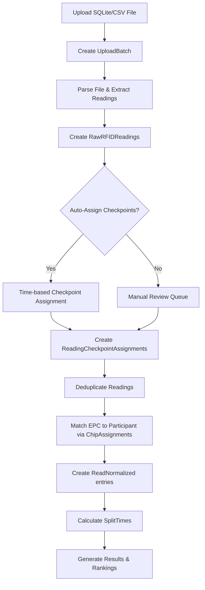

# RFID Upload System - Implementation Guide

## 🎯 Overview

This document outlines the implementation of the RFID file upload and processing system for the Runnatics Race Timing platform.

## 📊 Database Schema

### Core Tables

1. **UploadBatches** - Tracks each RFID file upload
   - Links to: `Races`, `Events`, `Devices`, `Checkpoints`
   - Stores file metadata, processing status, and statistics
   
2. **RawRFIDReadings** - Individual RFID tag detections from files
   - Links to: `UploadBatches`
   - Contains timing data, signal strength, deduplication info
   
3. **ReadingCheckpointAssignments** - Maps readings to race checkpoints
   - Links: `RawRFIDReadings` ↔ `Checkpoints` (many-to-many)

### Existing Integration Tables

4. **Chips** - RFID chip inventory (EPC-BIB mapping)
5. **ChipAssignments** - Participant chip assignments
6. **ReadNormalized** - Processed timing data
7. **SplitTimes** - Checkpoint split times
8. **Results** - Final race results

---

## 🔄 Data Flow



---

## 🔧 API Endpoints

### 1. Upload EPC-BIB Mapping
```http
POST /api/rfid/{eventId}/{raceId}/epc-mapping
Content-Type: multipart/form-data

File: Excel/CSV with columns [EPC, BIB]
```

**Purpose**: Maps RFID chip EPCs to participant BIB numbers

**Process**:
1. Parse Excel/CSV file
2. For each row:
   - Find or create `Chip` with EPC
   - Find `Participant` by BIB number
   - Create `ChipAssignment` linking chip to participant

### 2. Upload RFID File
```http
POST /api/rfid/{eventId}/{raceId}/import
Content-Type: multipart/form-data

File: SQLite database or CSV file with RFID readings
DeviceId: (optional)
ExpectedCheckpointId: (optional)
ReaderDeviceId: (optional)
TimeZoneId: "UTC"
FileFormat: "DB" | "CSV" | "JSON"
SourceType: "file_upload" | "live_sync"
```

**Purpose**: Upload and store raw RFID readings from a timing file

**Process**:
1. Validate file format and size
2. Calculate file hash (for duplicate detection)
3. Create `UploadBatch` record with status "uploading"
4. Parse file based on format:
   - **SQLite**: Query `TagReads` table
   - **CSV**: Parse rows with columns [EPC, Timestamp, Antenna, RSSI, etc.]
5. For each reading:
   - Create `RawRFIDReading` with all metadata
   - Store timestamp, signal strength, antenna info
6. Update `UploadBatch` statistics:
   - `TotalReadings`
   - `UniqueEpcs`
   - `TimeRangeStart` / `TimeRangeEnd`
7. Set status to "uploaded"

### 3. Process Upload Batch
```http
POST /api/rfid/{eventId}/{raceId}/import/{uploadBatchId}/process
Content-Type: application/json

{
  "uploadBatchId": "encrypted-id",
  "eventId": "encrypted-id",
  "raceId": "encrypted-id",
  "deduplicationWindowSeconds": 3,
  "autoAssignCheckpoints": true,
  "minCheckpointGapSeconds": 60
}
```

**Purpose**: Process raw readings, deduplicate, and assign to checkpoints

**Process**:
1. Get `UploadBatch` and all `RawRFIDReadings`
2. Set batch status to "processing"
3. **Deduplication**:
   - Group readings by EPC
   - For each EPC, sort by TimestampMs
   - Mark duplicates within deduplication window (e.g., 3 seconds)
   - Set `DuplicateOfReadingId` for duplicates
   - Set `ProcessResult` = "Duplicate"
4. **Checkpoint Assignment**:
   - If `autoAssignCheckpoints = true`:
     - Group readings by time gaps
     - Assign sequential checkpoints based on race course
   - Create `ReadingCheckpointAssignment` for each reading
   - Set `AssignmentMethod` = "Auto" or "Manual"
5. Set readings `ProcessResult` = "Success" or "Pending"
6. Update batch status to "completed"

### 4. Deduplicate & Normalize
```http
POST /api/rfid/{eventId}/{raceId}/deduplicate
```

**Purpose**: Create normalized timing data from processed readings

**Process**:
1. Get all `RawRFIDReadings` with `ProcessResult` = "Success"
2. For each reading:
   - Get `CheckpointId` from `ReadingCheckpointAssignments`
   - Match `EPC` to `ParticipantId` via `ChipAssignments`
   - Calculate timing:
     - `ChipTime` = reading timestamp
     - `GunTime` = time since race start
     - `NetTime` = time since participant start
   - Create `ReadNormalized` entry
3. Calculate `SplitTimes` for each participant at each checkpoint
4. Generate `Results` and rankings

---

## 💾 SQLite File Structure

Expected schema for uploaded SQLite databases:

```sql
-- Example: Impinj reader database
CREATE TABLE TagReads (
    EPC VARCHAR(50),
    FirstSeenTime DATETIME,
    Antenna INTEGER,
    PeakRSSI REAL,
    ChannelIndex INTEGER,
    TagSeenCount INTEGER
);

-- or alternative format
CREATE TABLE Reads (
    TagId VARCHAR(50),
    ReadTime BIGINT,  -- Unix timestamp in milliseconds
    AntennaPort INTEGER,
    RSSI REAL
);
```

### Parsing Logic

```csharp
// Open SQLite connection
using var connection = new SQLiteConnection($"Data Source={filePath}");
await connection.OpenAsync();

// Detect table structure
var tables = await DetectTablesAsync(connection);

// Parse based on detected format
if (tables.Contains("TagReads"))
{
    var cmd = new SQLiteCommand("SELECT EPC, FirstSeenTime, Antenna, PeakRSSI FROM TagReads", connection);
    // ... parse rows
}
else if (tables.Contains("Reads"))
{
    var cmd = new SQLiteCommand("SELECT TagId, ReadTime, AntennaPort, RSSI FROM Reads", connection);
    // ... parse rows
}
```

---

## 🔀 Checkpoint Assignment Strategies

### 1. Sequential Assignment
- First reads → Checkpoint 1 (Start)
- Middle reads → Checkpoint 2, 3, ... (Intermediate)
- Last reads → Final Checkpoint (Finish)

### 2. Time-Gap Based Assignment
```csharp
// Pseudocode
var readings = GetReadingsSortedByTime(epc);
var checkpoints = GetCheckpointsOrdered(raceId);
var checkpointIndex = 0;

for (int i = 0; i < readings.Count; i++)
{
    var gap = readings[i].TimestampMs - readings[i-1].TimestampMs;
    
    // If gap > minCheckpointGapSeconds, move to next checkpoint
    if (gap > minCheckpointGapSeconds * 1000)
    {
        checkpointIndex++;
    }
    
    AssignToCheckpoint(readings[i], checkpoints[checkpointIndex]);
}
```

### 3. Manual Review
- Readings with low confidence → RequiresManualReview = true
- Admin reviews and manually assigns checkpoints
- Update `AssignmentMethod` = "Manual"

---

## 🧪 Testing Strategy

### Unit Tests
- File parsers (SQLite, CSV)
- Deduplication logic
- Checkpoint assignment algorithms
- Time calculations

### Integration Tests
- End-to-end upload flow
- Processing with real data
- Database transactions

### Performance Tests
- Large file uploads (100k+ readings)
- Concurrent uploads
- Query performance on indexed columns

---

## 🚀 Implementation Checklist

### Phase 1: File Upload ✅
- [x] Update request/response models
- [ ] Implement SQLite file parser
- [ ] Implement CSV file parser
- [ ] Create UploadBatch on upload
- [ ] Store RawRFIDReadings
- [ ] Calculate file statistics

### Phase 2: Processing
- [ ] Implement deduplication logic
- [ ] Implement checkpoint assignment strategies
- [ ] Create ReadingCheckpointAssignments
- [ ] Handle manual review workflow

### Phase 3: Normalization
- [ ] Match EPCs to Participants
- [ ] Create ReadNormalized entries
- [ ] Calculate split times
- [ ] Generate results

### Phase 4: UI/UX
- [ ] Upload progress indicator
- [ ] Duplicate detection visualization
- [ ] Manual checkpoint assignment interface
- [ ] Results export functionality

---

## 📚 Key Algorithms

### Deduplication Algorithm

```csharp
public async Task<DeduplicationResponse> DeduplicateReadingsAsync(int batchId, int windowSeconds)
{
    var readings = await GetReadingsByBatchAsync(batchId);
    var groupedByEpc = readings.GroupBy(r => r.Epc);
    
    int duplicateCount = 0;
    
    foreach (var group in groupedByEpc)
    {
        var sorted = group.OrderBy(r => r.TimestampMs).ToList();
        RawRFIDReading? previous = null;
        
        foreach (var reading in sorted)
        {
            if (previous != null)
            {
                var gapMs = reading.TimestampMs - previous.TimestampMs;
                
                if (gapMs < windowSeconds * 1000)
                {
                    // Mark as duplicate
                    reading.ProcessResult = "Duplicate";
                    reading.DuplicateOfReadingId = previous.Id;
                    duplicateCount++;
                }
                else
                {
                    // Keep as valid
                    reading.ProcessResult = "Success";
                    previous = reading;
                }
            }
            else
            {
                reading.ProcessResult = "Success";
                previous = reading;
            }
        }
    }
    
    await _repository.SaveChangesAsync();
    
    return new DeduplicationResponse
    {
        TotalReadings = readings.Count,
        DuplicateCount = duplicateCount,
        UniqueReadings = readings.Count - duplicateCount
    };
}
```

---

## 🔐 Security Considerations

1. **File Validation**
   - Max file size: 100 MB
   - Allowed formats: SQLite, CSV, JSON
   - Virus scanning (optional)

2. **SQL Injection Prevention**
   - Use parameterized queries for SQLite parsing
   - Validate column names against whitelist

3. **Authorization**
   - Only admins can upload files
   - Tenant-based access control
   - Event ownership verification

4. **Data Encryption**
   - Encrypt IDs in API responses
   - Secure file storage with access controls

---

## 📖 References

- EF Core Fluent API configurations in `/Runnatics.Data.EF/Config/`
- Entity models in `/Runnatics.Models.Data/Entities/`
- Database schema in `CreateRFIDTables_Fixed.sql`

---

## 🆘 Troubleshooting

### Issue: Duplicate readings not detected
- Check deduplication window setting
- Verify TimestampMs values are in correct format
- Ensure readings are sorted by time

### Issue: Checkpoint assignment fails
- Verify checkpoints exist for the race
- Check checkpoint order and distances
- Review time gap thresholds

### Issue: Participants not matched
- Ensure ChipAssignments exist
- Verify EPC values match exactly
- Check participant is active and not deleted

---

## 🎓 Best Practices

1. **Always validate batch status** before processing
2. **Use transactions** for bulk operations
3. **Log all processing steps** for debugging
4. **Provide detailed error messages** for users
5. **Use background jobs** for large file processing
6. **Cache frequently accessed data** (checkpoints, participants)
7. **Archive processed batches** after 90 days

---

*Last Updated: 2026-01-27*  
*Version: 1.0*  
*Author: Copilot AI Assistant*
